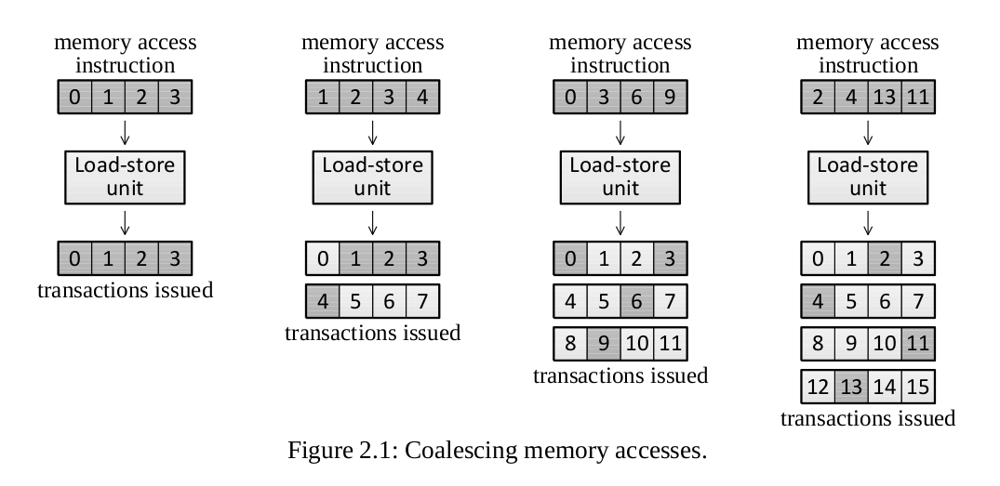

Animations of CUDA GPU memory access patterns.
Runs in web browsers that support the HTML5 [Canvas API](https://developer.mozilla.org/en-US/docs/Web/API/Canvas_API).

The main goal of this project is to provide intuitive visualizations of the challenges related to data locality when programming CUDA-supported GPUs.
As a consequence, many relevant hardware-level details have been omitted in the animations in favor of simplicity.

## GPU global memory access

One of the most significant aspects to consider when optimizing CUDA programs is the performance limitations caused by memory bandwidth during data transfer between the device memory and processing units [1][2][3].
When a thread warp requests access to global memory, the amount of memory transactions generated depends on the alignment of the data being accessed [2].
In the best case scenario, all 32 threads of a warp access consecutive, naturally aligned addresses of 4-byte words.
In this case, all words fit neatly into one 128-byte cache line and the GPU can fetch all words using a single 128-byte memory transaction.
However, if the memory accesses are scattered, the GPU has to access the data using multiple transactions, which reduces the memory throughput.

The image below, taken from [7], provides a clear illustration:

### Computational power vs. memory bandwidth

Mei and Chu point out that while NVIDIA's GTX 980 (Maxwell architecture) has a computational power of 4612 GFlop/s, its theoretical memory bandwidth is only 224 GB/s [1][4].
It seems that this gap has only increased on NVIDIA's GTX 1080 card (Pascal architecture), which NVIDIA reports having a computational power of 8873 GFlop/s, while the theoretical memory bandwidth is limited to 320 GB/s [5].
With the newest Volta architecture, NVIDIA reports that they have increased the computational power up to 15700 GFlop/s for 32-bit floating point numbers, while the new HBM2 memory subsystem is reported to enable 900 GB/s peak memory bandwidth [6].
Another significant change they describe is the merging of the on-chip shared memory and L1 caches, reducing the significance of manual caching management using shared memory.

## References

[1] Xinxin Mei, and Xiaowen Chu.
"Dissecting GPU memory hierarchy through microbenchmarking."
IEEE Transactions on Parallel and Distributed Systems 28.1 (2017). pp. 72-86.
Available [online](https://arxiv.org/abs/1509.02308).

[2] "CUDA C Programming Guide."
NVIDIA Corporation, version PG-02829-001_v9.2 (May 2018).
Available [online](https://docs.nvidia.com/cuda/cuda-c-programming-guide/index.html).

[3] "CUDA C Best Practices Guide."
NVIDIA Corporation, version DG-05603-001_v9.2 (May 2018).
Available [online](https://docs.nvidia.com/cuda/cuda-c-best-practices-guide/index.html).

[4] "GeForce GTX 980 Whitepaper"
NVIDIA Corporation, (2014).
Available [online](https://international.download.nvidia.com/geforce-com/international/pdfs/GeForce_GTX_980_Whitepaper_FINAL.PDF)

[5] "GeForce GTX 1080 Whitepaper"
NVIDIA Corporation, (2016).
Available [online](https://international.download.nvidia.com/geforce-com/international/pdfs/GeForce_GTX_1080_Whitepaper_FINAL.pdf)

[6] "Tesla V100 Architecture"
NVIDIA Corporation, (August 2017).
Available [online](https://images.nvidia.com/content/volta-architecture/pdf/volta-architecture-whitepaper.pdf)

[7] Volkov Vasily
"Understanding Latency Hiding on GPUs"
UC Berkeley, (2016).
ProQuest ID: Volkov_berkeley_0028E_16465. Merritt ID: ark:/13030/m5f52bdd.
Available [online](https://escholarship.org/uc/item/1wb7f3h4)
